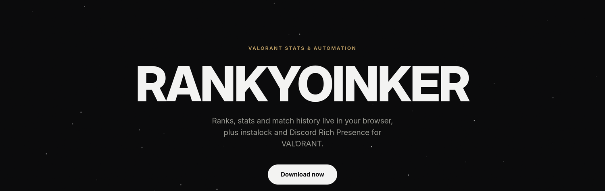
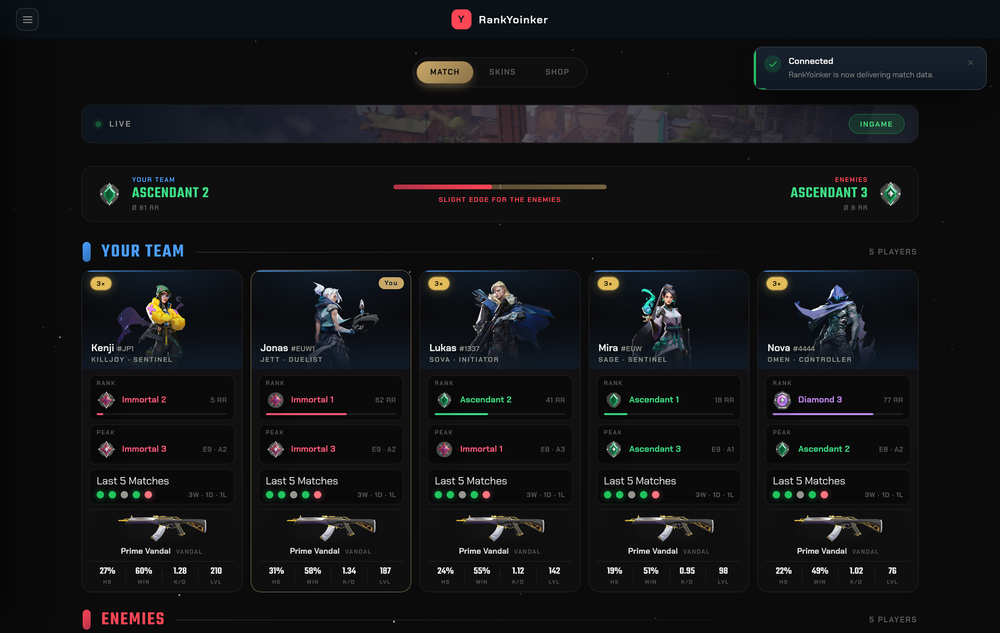
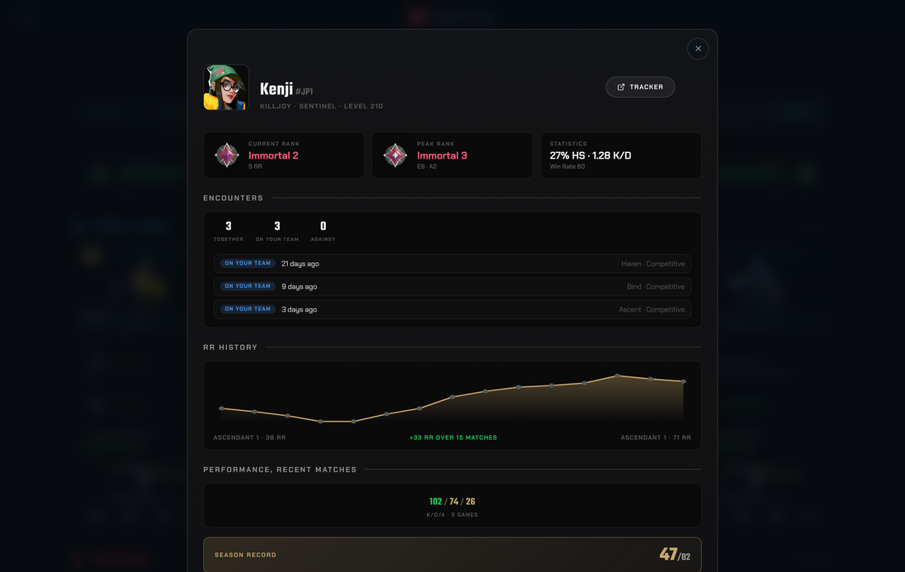
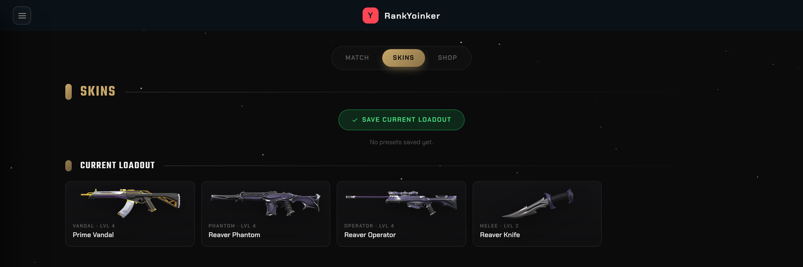
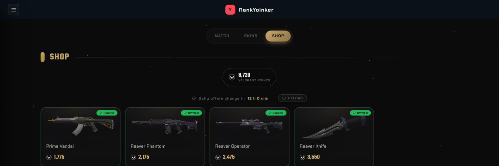
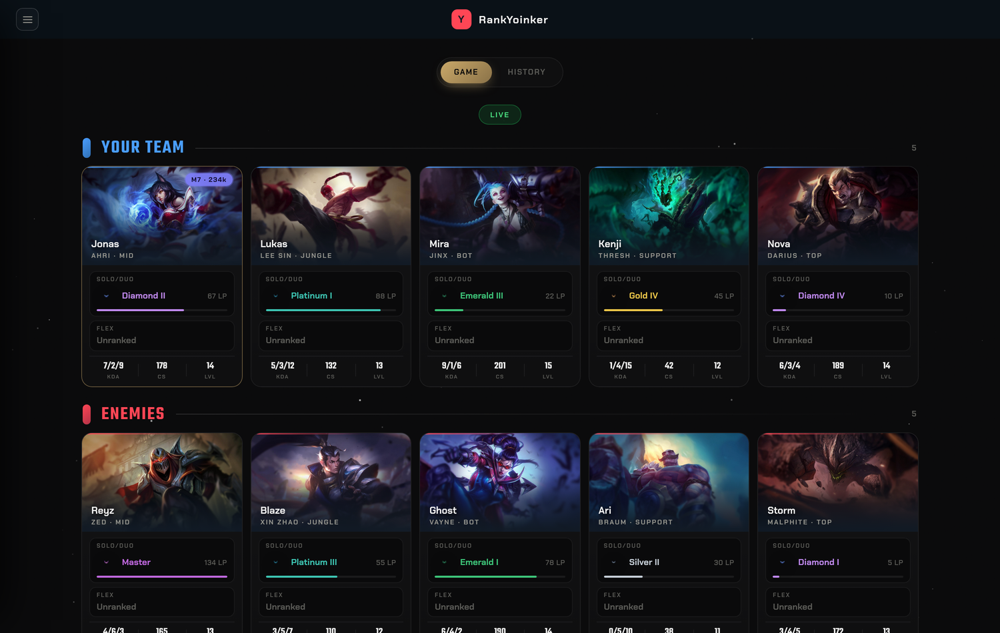
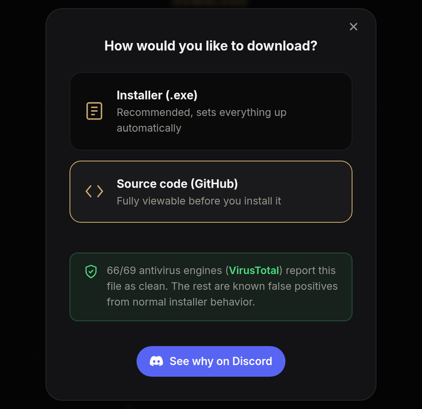

<div align="center">



# RankYoinker

**Ranks, stats, instalock, and Discord Rich Presence for VALORANT and League of Legends, live in your browser with zero manual setup.**

[](https://github.com/zdruqz-js/rankyoinker/actions/workflows/build-release.yml)
[](https://github.com/zdruqz-js/rankyoinker/releases/latest)
[](VRY-LICENSE.txt)
[](https://discord.gg/rankyoinker)

[**Download**](https://rankyoinker.de/download) · [Live preview](https://rankyoinker.de/demo/) · [Website](https://rankyoinker.de) · [Discord](https://discord.gg/rankyoinker)

</div>

---

## What it does

RankYoinker sits quietly in the background and shows up automatically the moment you're in a match, no button to click and no overlay to toggle. It works for both **VALORANT** and **League of Legends**, and switches between them on its own.

<table>
<tr>
<td width="55%" valign="top">

### Ranks & stats, live in your browser
Every player's rank, peak rank, K/D, headshot %, win rate and last 5 matches, for **your team and the enemies**, the moment the match loads. Click any player for their full breakdown: RR history graph, recent-match performance, and whether you've played with or against them before (party detection included).

</td>
<td width="45%">

</td>
</tr>
<tr>
<td width="45%">

</td>
<td width="55%" valign="top">

### Every player, one click away
RR curve over your last matches, a running log of encounters ("played together 3×, against 0×"), and season record, all computed from Riot's own API with nothing scraped or guessed.

</td>
</tr>
</table>

### More, at a glance

| | |
|---|---|
| 🔫 **Instalock with delay** | Locks your agent right on time, with jitter, even while the tab is closed. |
| 🎨 **Skins in the browser** | Browse and apply your owned weapon skins without opening the game. |
| 🛒 **Shop preview** | See today's shop and Night Market, no client alt-tab required. |
| 📱 **Phone pairing** | Scan a QR code to mirror the overlay on your phone. You choose which devices get access. |
| 🎮 **Discord Rich Presence** | Shows your live match status on Discord, automatically. |
| ⚔️ **League of Legends** | Auto-accept, preset bans/picks per lane, live match + ranked history. |
| 🌐 **7 languages** | German, English, Polish, French, Spanish, Turkish, Korean. See [Contributing translations](#contributing-translations). |

<table>
<tr>
<td width="50%"></td>
<td width="50%"></td>
</tr>
<tr>
<td colspan="2"></td>
</tr>
</table>

*All screenshots above are from the [live, mock-data preview](https://rankyoinker.de/demo/). Open it yourself, no install needed.*

## Verifiably built from source

Every release is built and published by **GitHub Actions on a clean Windows runner** ([`.github/workflows/build-release.yml`](.github/workflows/build-release.yml)), not on a personal machine. Each release also carries a **Sigstore build-provenance attestation**, cryptographic public proof that the exact `.exe` came from this repo, this commit, this workflow. You don't have to take our word for it:

```sh
gh release download <version> --repo zdruqz-js/rankyoinker --pattern "*.exe"
gh attestation verify RankYoinker-SetupV<version>.exe --owner zdruqz-js
```



The installer isn't code-signed yet (no paid certificate), so a couple of antivirus engines flag it on heuristics alone. The download dialog shows the live [VirusTotal](https://www.virustotal.com/) scan for the current release, and our [Discord FAQ](https://discord.gg/rankyoinker) explains exactly why, in plain terms.

## Install

Grab the installer from **[rankyoinker.de/download](https://rankyoinker.de/download)** (or the [latest GitHub release](https://github.com/zdruqz-js/rankyoinker/releases/latest) directly) and run it. It sets up autostart, a local firewall rule, and `http://vry` for the phone-pairing feature, that's it. Windows will likely show a SmartScreen warning ("Windows protected your PC") since there's no paid code-signing certificate yet; click **More info → Run anyway**, it's not a virus (see above).

## What's in this repo

This is the actual source that ships to users, minus build output and runtime state:

- **`index.html`**: the overlay itself (all UI, all client-side logic).
- **`vry_log_server.py`**: the local backend the overlay talks to. Reads the local Riot client (League/VALORANT) session, proxies Riot's own APIs, and serves `index.html` locally.
- **`lang/`**: one JSON file per language (`{code, label, reviewedBy, locale, strings}`). Both `index.html` and the website load these at runtime, so adding a language is just adding a file here, no code changes.
- **`setup/build_source/`**: the Python source that gets frozen (via `cx_Freeze`) into `vry.exe`, the small process that hooks into VALORANT/League itself. This is the part most worth reading if you want to verify there's nothing sketchy going on before running the installer.
- **`setup/install_all.py`** / **`setup/uninstall_all.py`**: what the installer actually runs. Autostart, a firewall rule, and an `http://vry` shortcut (both needed for the optional phone-pairing feature), nothing else.
- **`setup/RankYoinker.iss`**: the Inno Setup installer definition.
- **`.github/workflows/build-release.yml`**: the CI pipeline described above.

Not included: the embedded Python runtime (`.pyd`/`.dll`/`python.exe`, just the stock python.org "embeddable" distribution, fetched fresh by CI, not our code), build output, and any runtime state (logs, presets, your own `config.json`).

## Contributing translations

Each language lives in two small JSON files: `lang/<code>.json` (app, ~400 keys) and the equivalent on the website repo (~120 keys), both with the same shape: `{ "code": "de", "label": "Deutsch", "reviewedBy": "...", "locale": "de-DE", "strings": { ... } }`. To fix or review a translation, edit the relevant file and open a PR; once a native speaker confirms it, we add their name to `reviewedBy` (shown as a ✓ in the in-app language picker).

## License

Built on top of [VALORANT Rank Yoinker](https://github.com/zayKenyon/VALORANT-rank-yoinker) by Zay Kenyon and Contributors (ISC license). See `frozen_application_license.txt` and `setup/VRY-LICENSE.txt`.
